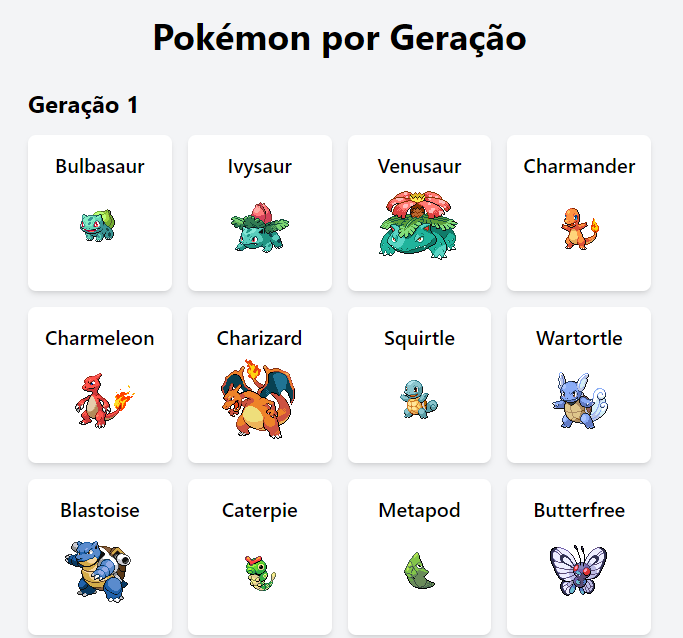

# Pokémon API

Este projeto é uma aplicação web que utiliza a [Pokémon API](https://pokeapi.co/) para exibir todos os Pokémon da 1ª até a 3ª geração (1-386). A aplicação é construída com React, TypeScript e TailwindCSS.

## Tecnologias Utilizadas

- **React**: Biblioteca JavaScript para construir interfaces de usuário.
- **TypeScript**: Um superset do JavaScript que adiciona tipos estáticos.
- **TailwindCSS**: Um framework CSS utilitário para criar designs personalizados rapidamente.
- **Pokémon API**: API pública para acessar dados sobre Pokémon.

## Demonstração

 

## Funcionalidades

- Visualização de todos os Pokémon da 1ª, 2ª e 3ª geração.
- Layout responsivo.

## Instalação

1. Clone o repositório:

   ```bash
   git clone https://github.com/joaopedroplinta/pokemon-api.git
2. Navegue até o diretório do projeto:
    ```bash
    cd pokemon-api
    ```
3. Instale as dependências:
    ```bash
    npm install
    ```
4. Inicie o servidor:
    ```bash
    npm run dev
    ```

## Contribuição

1. Faça um fork do projeto
2. Crie uma branch para sua feature (`git checkout -b feature/nome-da-feature`)
3. Commit suas alterações (`git commit -m 'Adiciona nova feature'`)
4. Faça o push para a branch (`git push origin feature/nome-da-feature`)
5. Abra um Pull Request

